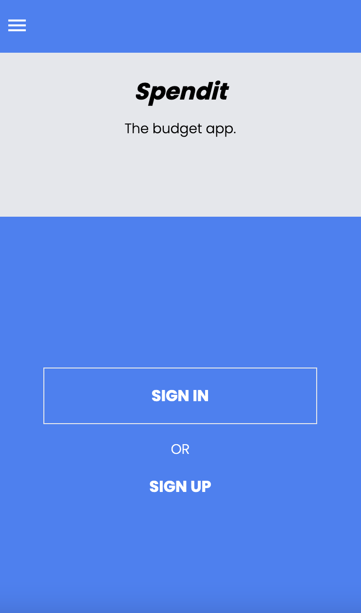
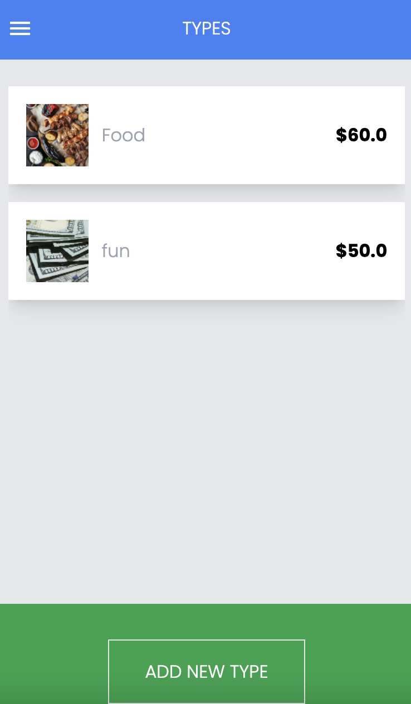
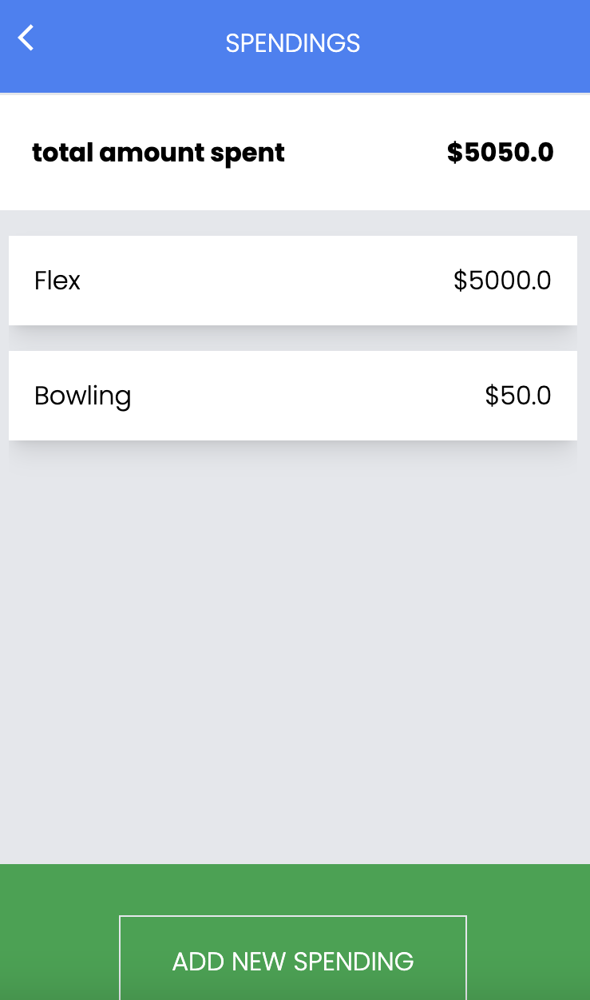

# Spendit - A Mobile Web App.

> **_Spendit_** is a mobile web application where you can manage your budget. Register, add a spending type and keep track of your spendings for each category. It's that simple.





## Built With

- Ruby
- Ruby on Rails
- Tailwind

## Getting Started

- Getting a local copy is simple. Follow the steps below

### Install

- Ruby
- Ruby on Rails
- PostgresSQL
- Rspec

### Local Copy

- Clone the project

```
git clone https://github.com/anuarshaidenov/SBB-app.git

cd SBB-app

```

### Setup

Install gems:

```
bundle install
```

Setup database:

```
rails db:create
rails db:migrate
```

### Usage

Start server:

```
rails server
```

Visit http://localhost:3000/ in your browser.

### Run tests

```
rspec
```

## Authors

👤 **Anuar Shaidenov**

- GitHub: [@anuarshaidenov](https://github.com/anuarshaidenov)
- Twitter: [@anuarnyi](https://twitter.com/anuarnyi)
- LinkedIn: [Anuar Shaidenov](https://www.linkedin.com/in/anuar-shaidenov-365a951b8/)

## Credits

Original design by [Gregoire Vella](https://www.behance.net/gregoirevella)

## 🤝 Contributing

Contributions, issues, and feature requests are welcome!

## Show your support

Give a ⭐️ if you like this project!

## 📝 License

This project is [MIT](./LICENSE.md) licensed.
